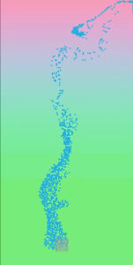

GPU Particle System for Unity
==============
## Features
* Curl Noise[1]
* Flow Map

# References
1. R. Bridson, J. Houriham, and M. Nordenstam, “Curl-Noise for Procedural Fluid Flow,” ACM SIGGRAPH 2007 Pap., 2007.
